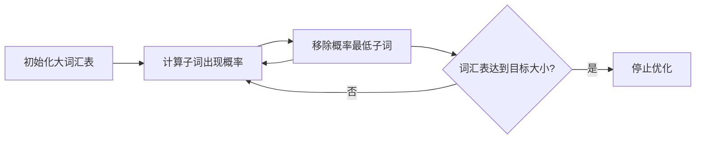
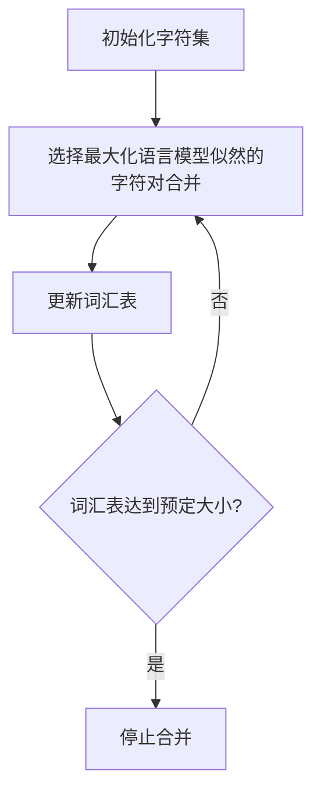
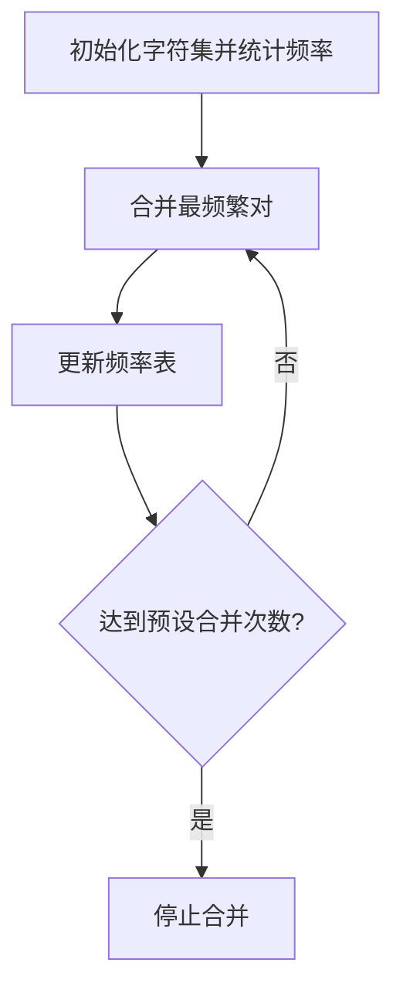

好的，我将总结并用Markdown和Mermaid来表示这三种分词算法的工作原理和示例。

### Unigram 分词算法

#### 工作原理

1. **初始化**：构建一个初始大词汇表，包含所有可能的子词（通常从单字母到整个单词的所有可能组合）。
2. **估计**：计算每个子词的出现概率，这通常通过统计子词在训练数据中的频率来完成。
3. **优化**：重复移除贡献最小的子词，即那些概率最低的子词，再重新估计剩余子词的概率。
4. **结束**：当词汇表大小降至目标大小或满足其他终止条件时，停止优化。

#### 计算示例

假设我们有句子 "aaabadaaabac"，初始词汇表包含{'a', 'b', 'c', 'd', 'aa', 'ab', 'ada', 'baa', 'bac'}。我们可能发现'aa'的概率很高，而'ada'的概率很低。在优化过程中，我们可能会移除'ada'和其他一些低概率候选，最终留下{'a', 'aa', 'b', 'c', 'd'}作为优化后的词汇表。

### WordPiece 分词算法

#### 工作原理

1. **初始化**：从字符集开始构建初始词汇表。
2. **选择合并**：在每次迭代中，选择当前数据中能够最大化语言模型似然的字符对合并。

    $\log P(t_z) - (\log P(t_x) + \log P(t_y)) = \log \left( \frac{P(t_z)}{P(t_x)P(t_y)} \right)$
3. **更新词汇表**：将选择的字符对添加到词汇表中作为新的子词。
4. **结束**：当词汇表达到预定大小或满足其他停止条件时，合并停止。

#### 计算示例

假设我们的数据包含单词 "low", "lower", "newest", "widest"。初始词汇表可能包含单个字符 {'l', 'o', 'w', 'e', 'r', 'n', 's', 't', 'd', 'i'}。在第一次迭代中，'e' 和 'r' 是最常出现的一对，因此合并为 'er'。新的词汇表可能是 {'l', 'o', 'w', 'e', 'r', 'n', 's', 't', 'd', 'i', 'er'}。这个过程将继续，直到达到词汇表大小的限制。

### BPE（Byte-Pair Encoding）分词算法

#### 工作原理

1. **初始化**：将文本分解为基础字符，并统计所有字符对的频率。
2. **合并最频繁对**：迭代地找出并合并最频繁出现的相邻字符对。
3. **更新频率表**：在每次合并后，更新字符对频率表。
4. **结束**：重复这个过程直到达到预设的合并次数或词汇表大小。

#### 计算示例

考虑 "aaabadaaabac" 这个字符串。初始字符对频率统计可能是 {('a', 'a'): 5, ('a', 'b'): 2, ('b', 'a'): 2, ('a', 'd'): 1, ('d', 'a'): 1, ('a', 'c'): 1}。最频繁的字符对是 ('a', 'a')，因此我们将其合并为一个新的单元 'aa'。更新文本为 "aaabadaaabc"，更新频率统计，然后继续合并过程。

参考：https://zhuanlan.zhihu.com/p/685785987